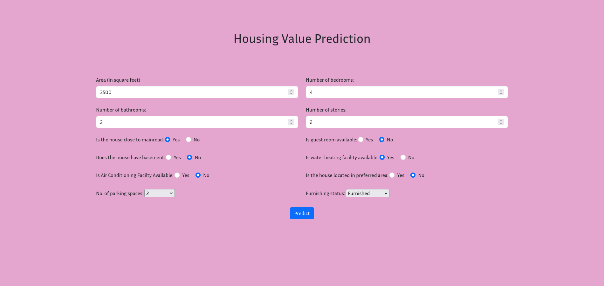

# HouseWorth

This repository contains a Python implementation for predicting house prices using machine learning techniques. The code utilizes a dataset of housing features to train and evaluate two regression models: Linear Regression and Random Forest Regression. The best model is selected based on a combined evaluation of Mean Squared Error (MSE) and R-squared (R²).

## Table of Contents

- [Dataset](#dataset)
- [Webpage Interface](#webpage-interface)
- [Usage](#usage)
- [Model Evaluation](#model-evaluation)
- [Model Selection](#model-selection)
- [Contributing](#contributing)
- [License](#license)


## Dataset
The project Utilizes the following dataset obtained from Kaggle.

- [Dataset used for Model Training](https://www.kaggle.com/datasets/ashydv/housing-dataset)

## Webpage Interface

<div align="center">
    
</div>

## Usage

To use the application, follow these steps:

1. Clone the repository:

   ```
   git clone --depth=1 https://github.com/praneeth-katuri/.git
   ```

2. Install the required dependencies:
   
   Python Version: `3.12.3`

   ```
   pip install -r requirements.txt
   ```

3. To start the Flask application, run the following command in your terminal:

   ```
   python app.py
   ```

4. To access the webpage interface, open `http://127.0.0.1:5000` in your web browser.

## Model Evaluation

The code evaluates the performance of the models using Mean Squared Error (MSE) and R-squared (R²) metrics. The results for both models are shown below.

### Results

- **Linear Regression**
  - Mean Squared Error: 85.57
  - R-squared: 0.71

- **Random Forest Regression**
  - Mean Squared Error: 102.19
  - R-squared: 0.65

## Model Selection

The best model is selected based on a combined score derived from both MSE and R². The MSE is inverted for normalization (since lower values are better), while R² is used as-is (since higher values are better). The combined score is calculated as follows:

```python
combined_score = 0.5 * normalized_mse + 0.5 * normalized_r2
```

The model with the highest combined score is considered the best model and is saved for future use.

the best model was determined to be **Linear Regression** with the following metrics:

- **Best Model MSE**: 85.57
- **Best Model R²**: 0.71

## Contributing

Contributions to this project are welcome! If you have ideas for improvements or new features, feel free to open an issue or submit a pull request.

## License

This project is licensed under the MIT License. See the [LICENSE](LICENSE) file for details.

---
